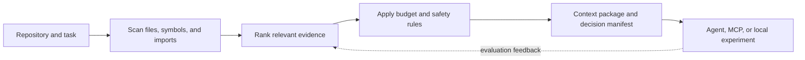

# AgenVantage

**A local agent context and token observability tool for developers.**

AgenVantage prepares focused, token-budgeted context packages from local repositories before a model call, then records the local token and provider-usage evidence needed to evaluate the tradeoff. It also cleans up the task prompt before retrieval, so users can see both the instruction they wrote and the repository evidence the agent received.

## What it offers

- Packs relevant repository files, symbols, imports, diffs, tests, and configuration for a coding task.
- Cleans and structures task prompts locally with `optimize-prompt` without making an extra model call.
- Supports `explain`, `feature`, `review`, `debug`, `change`, and `compare` workflows.
- Produces readable Markdown handoffs and machine-readable decision manifests.
- Works across one or more local repositories.
- Redacts secret-looking values and avoids dependency folders and `.env` files.
- Connects to Codex, Claude Code, Cursor, and MCP-based workflows.
- Records provenance so each context package can be inspected.

## Why I built it

AI coding tools are only as useful as the context they receive. Too little context causes missed details; too much makes work slower, more expensive, and harder to reason about. AgenVantage is my attempt to make that tradeoff measurable and inspectable.

## Implemented today

The current tool includes:

- Git-aware scanning, lexical ranking, symbol/import signals, and budgeted selection.
- Feature-work handoffs that reserve room for likely edit files, tests, and configuration evidence.
- Persistent local repository metadata for faster repeated runs.
- Deterministic secret redaction, include/exclude path controls, and diff provenance.
- A lightweight MCP server with `prepare_context`, `expand_context`, `search_graph`, and `context_status` tools.
- Local experiment harnesses for policy comparison, feature-work validation, provider-usage normalization, and context observability.
- Cache-aware sessions that separate stable repository context from changing task instructions.
- A deterministic prompt optimizer that removes filler and duplicate sentences, detects workflow mode, reports missing task signals, and estimates local prompt-token reduction.

## Product scope

AgenVantage is one local control plane for agent input efficiency:

1. **Task shaping:** turn an informal request into a concise, testable instruction.
2. **Repository grounding:** select the smallest defensible set of files, symbols, tests, configuration, and provenance.
3. **Session reuse:** keep stable context separate from dynamic task packets for cache-aware workflows.
4. **Observability:** show local token estimates, selection decisions, cache behavior, provider usage, latency, and quality annotations in one traceable record.

The project does not claim that a shorter local prompt automatically reduces provider billing or preserves answer quality. Those claims require provider-reported usage and downstream quality evidence. The local optimizer is deterministic by design; an AI rewrite is intentionally not part of the default path because it adds latency, cost, and another source of nondeterminism.

## Research and active experiments

This repository is also a lab notebook. I am actively researching and implementing:

- Whether smaller context packages preserve task quality, not just reduce local prompt size.
- Control-versus-treatment evaluation with provider usage, latency, caching, cost estimates, and task-completion checks.
- Repository graphs and bounded traversal as a supplement to lexical retrieval.
- Manager/worker agent workflows with explicit handoffs and verification.
- Mixed text-and-image context for bulky background material while keeping exact code evidence recoverable as text.
- Better retrieval rubrics, benchmark cases, and downstream software-engineering evaluations.

These experiments are intentionally labeled as experiments. Local token reduction is not the same as proven provider cost savings, and current results do not establish broad workload quality retention.

## Inspired by other tools

Some parts of AgenVantage are deliberate experiments inspired by adjacent tools and research:

- **Graphify:** optional graph-assisted repository retrieval and ablation work.
- **pxpipe:** a mixed-modality artifact path that renders selected background context while preserving exact identifiers and recoverable source blocks.
- **OpenTelemetry and LLM observability tools:** local trace and provenance concepts for comparing context policies over time.
- **Tool-search and prompt-caching patterns:** research into loading stable or relevant context only when needed.

The goal is to study and adapt useful ideas, not to claim equivalence with those projects or reproduce their production guarantees.

## Architecture



## Quick start

```bash
make setup
source .venv/bin/activate   # Windows: .venv\\Scripts\\activate
agenvantage demo
```

Try it on another repository:

```bash
cd /path/to/your-repo
agenvantage compare --task "Fix the bug and add a regression test"
agenvantage pack --preset feature --task "Add a small feature" --handoff-json
agenvantage optimize-prompt --text "Fix the bug in the repo and run tests"
```

Install the optional local integrations:

```bash
agenvantage init
agenvantage doctor
agenvantage mcp
```

Run the test suite with `pytest` or `make test`.

## Repository defaults

If you keep reaching for the same `pack` flags, add a local `.agenvantage.toml` file at the repository root:

```toml
[pack]
budget = 6000
preset = "feature"
top_k = 20
include_glob = ["src/**", "tests/**"]
exclude_glob = ["dist/**", "coverage/**"]
```

`include_glob` and `exclude_glob` accept a string or a list of strings. AgenVantage now rejects non-string entries instead of silently coercing them, which makes bad config easier to spot.

For local secrets, AgenVantage will also load the nearest `.env` file it finds while walking upward from the current working directory. Existing environment variables still win, and unquoted inline comments like `OPENAI_API_KEY=value # local dev` are ignored.

## Research notes

- [Repository-context research](docs/repository-context-research.md)
- [Open-source repository intelligence](docs/prd-open-source-repository-intelligence.md)
- [Context performance platform](docs/prd-context-performance-platform.md)
- [Paired feature implementation validation](docs/paired-feature-implementation-validation.md)
- [Graphify integration and ablation](docs/graphify-ablation-results.md)
- [Hierarchical agent development](docs/prd-hierarchical-agent-development.md)

## Project status

AgenVantage is a personal research project with working local tooling and an expanding evaluation suite. It is not yet a production enterprise platform, and its provider-backed claims remain an active area of validation.
