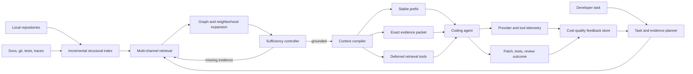

# PRD: AgenVantage Context Performance Platform

Prepared: July 10, 2026  
Status: proposed technical north star  
Audience: maintainers, contributors, coding-agent integrators, and evaluators

## 1. Executive Summary

AgenVantage should become a local-first context control plane for coding agents.
It should understand a repository broadly without sending that repository to a
model, locate the minimum evidence needed for a concrete task, expose more
context only when the task remains under-grounded, arrange repeated context for
provider caching, and measure whether the resulting agent run actually used
fewer billed tokens and dollars without losing task success.

The product is not another code editor and should not try to replace Cursor,
Codex, Claude Code, or Copilot. It should sit below or beside those agents as an
open, provider-neutral optimization and observability layer:

```text
repository + task + agent configuration
                 |
                 v
       local repository intelligence
                 |
                 v
     quality-constrained context planner
                 |
                 v
 prompt prefix + exact evidence + retrieval tools
                 |
                 v
         Codex / Cursor / Claude / API
                 |
                 v
 actual usage + tool trajectory + patch outcome
                 |
                 v
       cost, quality, and latency feedback
```

The optimization objective is not "maximize token reduction." It is:

```text
minimize total realized task cost
subject to task success and grounding quality remaining acceptable
```

This distinction is required by the current evidence. AgenVantage's current
12-case feature benchmark reports a `93.22%` median additive-corpus-to-pack reduction,
with stronger coverage than the earlier snapshot, but a
cold run on the previously unseen `gameFit` repository reduced `157,858` tokens
to `2,242` (`98.58%`) while omitting dashboard and styling context needed to
start the requested feature confidently. Compression worked; minimum-sufficient
context did not.

## 2. Product Thesis

Coding agents do not need every repository token in every request. They need:

1. a compact map that makes the repository navigable;
2. exact evidence for the current edit and validation surface;
3. cheap tools for retrieving omitted evidence on demand;
4. a stable session prefix that can be cached across turns; and
5. telemetry that attributes cost and failure to retrieval, inference, tools,
   retries, or missing context.

AgenVantage's ideal state is therefore:

> A local repository-intelligence and context-optimization layer that gives
> coding agents the smallest sufficient, cache-efficient working set and proves
> the effect using provider usage and completed-task outcomes.

Its durable differentiation is not generic RAG. It is the combination of:

- code-aware, requirement-driven repository exploration;
- a measurable context budget and explicit sufficiency gate;
- dynamic retrieval rather than a one-time static prompt dump;
- cache-aware prompt compilation and session deltas;
- provider-neutral traces joining context decisions to real agent outcomes; and
- local-first operation with inspectable rankings and no mandatory cloud index.

## 3. Current State And Evidence

### 3.1 Verified local capabilities

The current repository implements:

- tracked-file scanning with exclusions and secret redaction;
- content-hash-based metadata reuse;
- lexical task ranking with symbol and import boosts;
- line-addressed chunks and feature-oriented change-surface categories;
- git diff/log provenance;
- token-budgeted Markdown and JSON handoffs;
- cache-shaped sessions;
- optional mixed-modality artifacts;
- local SQLite traces and provider-record normalization; and
- deterministic feature and use-case benchmarks.

Current 12-task feature benchmark across four owned repositories (July 11,
2026; rerun with `benchmarks/feature_work_validation.py`):

| Metric | Current result |
| --- | ---: |
| Edit-target recall | `0.9583` |
| Test-target recall | `1.0000` |
| Required-observation recall | `0.9722` |
| Context-plan readiness rate | `0.9167` |
| Median full-scan prompt | `74,941` tokens |
| Median packed prompt | `3,919` tokens |
| Median reduction | `93.22%` |

These results verify local context reduction against an additive full-scan
counterfactual and measure deterministic retrieval coverage. The
counterfactual is summed from independently tokenized blocks, not rendered or
sent to a model. These results do not prove
that a real coding agent would otherwise send
the full scan, that the provider billed fewer tokens, or that completed patches
retain quality.

### 3.2 Critical cold-start failure

Unseen-repository task:

```text
Add a weekly workout streak visualization to the dashboard that shows current
streak, longest streak, and missed workout days.
```

Observed result on `gameFit`:

| Metric | Result |
| --- | ---: |
| Eligible scanned files | `34` |
| Candidate chunks | `255` |
| Full-scan counterfactual | `157,858` tokens |
| Packed prompt | `2,242` tokens |
| Reduction | `98.58%` |
| Requested budget | `6,000` tokens |
| Effective feature budget | `1,800` tokens |
| Practical sufficiency | failed |

The pack selected one `App.tsx` excerpt plus recommendation code, recommendation
tests, and catalog data. It did not expose enough dashboard render structure,
state shape, styling, or component context. Important request terms remained
uncovered. The fixed `1,800`-token feature target optimized past the point of
sufficiency.

### 3.3 Claims boundary

Today the project can claim measured local prompt-size reduction and partial
retrieval sufficiency on a small hand-authored task set. It cannot yet claim:

- real billed API savings across coding-agent workflows;
- production latency improvement;
- broad downstream patch-quality retention;
- end-to-end resolution of agent context overload; or
- superiority to built-in Cursor, Codex, Claude Code, or Copilot retrieval.

This PRD is designed to cross those boundaries with functionality, not wording.

## 4. Research Findings That Drive The Design

### 4.1 Index the repository; do not place the repository in the prompt

Cursor describes a persistent index built from a Merkle tree, syntactic chunks,
and cached embeddings. Only changed branches and chunks need reprocessing. Its
published evaluation reports semantic search improving response accuracy by
`12.5%` on average, and its index-reuse work sharply reduces time to first
query on large repositories. AgenVantage should copy the architectural lesson,
not the hosted implementation: broad knowledge belongs in a local index, while
only retrieved evidence belongs in model context.

Source: [Cursor, Securely indexing large codebases](https://cursor.com/blog/secure-codebase-indexing)

### 4.2 Keep a small structural map available before task-specific retrieval

Aider builds a repository map from symbols and dependency edges, graph-ranks
the result, and fits the most important identifiers into a dynamic token
budget. It expands the map when no files are in context. This is the right
cold-start behavior for AgenVantage: unfamiliar tasks need more navigation
context than already-grounded tasks.

Source: [Aider repository map](https://aider.chat/docs/repomap.html)

### 4.3 Combine exact, semantic, and structural retrieval

Sourcegraph documents keyword search, query rewriting, native code search, and
code-graph relationships as complementary context sources. Anthropic reports
that combining contextual embeddings with contextual BM25 reduced top-20
retrieval failures by `49%` in its evaluated domains, and reranking reduced
failures by `67%`. The exact percentages are not transferable to code without
measurement, but the design lesson is strong: exact identifiers, semantic
intent, and relationships fail differently and should be fused.

Sources:

- [Sourcegraph Cody context](https://sourcegraph.com/docs/cody/core-concepts/context)
- [Anthropic Contextual Retrieval](https://www.anthropic.com/engineering/contextual-retrieval)

### 4.4 Retrieve iteratively and stop when marginal evidence is low

RepoCoder's iterative retrieval-generation approach improves repository-level
completion over one-shot retrieval. RLCoder adds a learned stop signal because
not every task needs more repository information and retrieved context can be
harmful. AgenVantage should implement the same control shape without requiring
a learned model initially: explore, assess evidence slots, expand, and stop.

Sources:

- [RepoCoder](https://arxiv.org/abs/2303.12570)
- [RLCoder](https://arxiv.org/abs/2407.19487)

### 4.5 Evaluate exploration at line level and against downstream work

SWE-Explore evaluates ranked code regions under a fixed line budget and finds
that line-level coverage and efficient ranking distinguish strong explorers.
CORE-Bench separates code understanding, issue-to-edit localization, and
broader supporting-context retrieval. ContextBench distinguishes explored from
actually utilized context and reports that unfiltered context can have little
or negative value. AgenVantage therefore needs region recall, utilization, and
task outcome metrics, not only expected-file recall.

Sources:

- [SWE-Explore](https://arxiv.org/abs/2606.07297)
- [CORE-Bench](https://arxiv.org/abs/2606.11864)
- [ContextBench](https://arxiv.org/abs/2602.05892)

### 4.6 Long context is capacity, not guaranteed comprehension

"Lost in the Middle" shows that answer quality can depend on where evidence is
placed in a long context and can degrade when relevant information is buried.
AgenVantage should order evidence by task role and confidence and should not
treat a larger context window as a reason to stop retrieving carefully.

Source: [Lost in the Middle](https://arxiv.org/abs/2307.03172)

### 4.7 Repository knowledge should support progressive disclosure

OpenAI's agent-first engineering write-up describes a short `AGENTS.md` as a
map into structured, versioned repository knowledge rather than a large manual.
It also emphasizes making logs, metrics, tests, and architecture mechanically
legible to agents. AgenVantage should index these sources and expose them by
task role, not concatenate them by default.

Source: [OpenAI, Harness engineering](https://openai.com/index/harness-engineering/)

### 4.8 Stable prefixes and deferred tools produce different savings

OpenAI prompt caching requires matching prefixes and recommends static content
first and variable content last. Provider usage distinguishes cached from
uncached input. OpenAI tool search similarly avoids loading every tool schema up
front and injects discovered tools at the end to preserve the cache. Anthropic
documents placing cache breakpoints at the end of the stable prefix and warns
that a changing block at the breakpoint defeats cache reuse.

Sources:

- [OpenAI prompt caching](https://developers.openai.com/api/docs/guides/prompt-caching)
- [OpenAI tool search](https://developers.openai.com/api/docs/guides/tools-tool-search)
- [Anthropic prompt caching](https://platform.claude.com/docs/en/build-with-claude/prompt-caching)

### 4.9 Operational metrics and quality signals are separate

OpenTelemetry's GenAI conventions standardize model, input-token, output-token,
and related attributes. Datadog separates trace-level cost/token/latency data
from quality evaluations. AgenVantage should follow that boundary: token
savings are operational evidence; successful tests and accepted patches are
quality evidence. One must never stand in for the other.

Sources:

- [OpenTelemetry GenAI observability](https://opentelemetry.io/blog/2026/genai-observability/)
- [Datadog Agent Observability metrics](https://docs.datadoghq.com/llm_observability/monitoring/metrics/)
- [Datadog cost monitoring](https://docs.datadoghq.com/llm_observability/monitoring/cost/)

## 5. Goals

### 5.1 Functional goals

1. Produce sufficient first-request context for feature, bug, review, explain,
   migration, and incident tasks on repositories not seen during development.
2. Let an agent retrieve exact omitted code dynamically without re-sending the
   repository or rebuilding the index.
3. Reduce total provider input and tool-result tokens across an entire task,
   including retries and context-recovery turns.
4. Increase cache-read tokens and reduce fresh-prefix tokens in repeated work.
5. Attribute every context decision to source revision, retrieval reason,
   token cost, agent use, and final task outcome.
6. Operate locally without embeddings or provider calls in the default path,
   while allowing optional local or hosted semantic/reranking backends.
7. Integrate with existing agents through CLI, JSON, MCP, SDK, and trace import
   rather than requiring a new editor.

### 5.2 Performance goals

Performance has four independent dimensions:

- retrieval quality: was required evidence found and ranked early?
- context efficiency: how many fresh tokens were needed per successful task?
- runtime efficiency: how much indexing, retrieval, and agent time was added?
- economic efficiency: what did the provider actually bill after cache effects?

No release should trade a large quality loss for a large token reduction.

## 6. Non-Goals

The performance roadmap should not prioritize:

- a hosted dashboard or polished web UI;
- more artifact formats without a measured retrieval or cost gain;
- image conversion for exact implementation evidence;
- an AgenVantage-native coding model or editor;
- replacing provider-native agent loops;
- claiming provider savings from tokenizer estimates; or
- optimizing only the first prompt while total task tokens increase.

CLI summaries and local traces remain necessary to operate and verify the
engine, but they are supporting surfaces rather than the product's core value.

## 7. Primary Use Cases

### 7.1 Cold feature implementation

Given an unfamiliar repository and a feature request, identify the existing
entrypoint, state/data model, render or API surface, tests, styles/config, and
supporting abstractions. Return enough exact code to form the first correct edit
plan and leave lower-confidence context behind retrieval handles.

### 7.2 Bug localization

Given an error, stack trace, failing test, or unexpected behavior, anchor exact
identifiers first, follow call/import/data-flow edges, include recent relevant
changes, and stop after the failure path and validation surface are grounded.

### 7.3 Review and hardening

Use the diff as the primary scope, expand to definitions, callers, tests,
contracts, and policy boundaries, and avoid unrelated repository context.

### 7.4 Cross-repository change

Resolve package/service relationships, revisions, shared schemas, and call
edges across a named repository set. Require evidence from every affected
repository before declaring the pack sufficient.

### 7.5 Long-running feature session

Freeze stable architecture, conventions, and accepted decisions in a
cache-aligned prefix. Send only the current request, changed code, fresh test
results, and newly retrieved evidence each turn.

### 7.6 Production agent optimization

Wrap or instrument an existing coding-agent workflow, compare optimized and
native context strategies, and report actual input, cache-read, output, tool,
latency, retry, outcome, and cost deltas at task level.

## 8. Ideal-State Architecture



### 8.1 Incremental repository intelligence layer

The index is broad but local. Index size does not consume prompt tokens.

Persist by repository revision and content hash:

- file paths, language, size, generated/vendor/test/config/doc role;
- AST symbols with kind, visibility, signature, and line range;
- imports, exports, inheritance, calls, references, routes, commands, tests,
  schemas, config keys, and endpoint relationships where parsers support them;
- reverse edges such as caller, imported-by, tested-by, and implements;
- lexical term statistics for BM25F across path, symbol, comment, and body;
- chunk text and contextual metadata;
- optional embedding vector keyed by content hash;
- git revision, ownership, churn, recency, and changed-line metadata; and
- framework-specific landmarks such as React roots, server routes, migrations,
  dependency manifests, and CI entrypoints.

Implementation direction:

- use tree-sitter or language-native parsers for supported languages;
- retain regex fallback for unsupported or malformed files;
- use a Merkle tree or equivalent directory/content-hash hierarchy for cheap
  freshness checks;
- update changed files and affected reverse edges only;
- expose index age and revision mismatch to the planner; and
- keep all derived data reconstructible from repository content.

### 8.2 Compact repository map

Build a `500-1,500` token map containing the highest-value modules, public
symbols, dependency boundaries, executable entrypoints, test layout, and
repository instructions. Rank nodes using dependency centrality plus task
relevance. This map is navigation context, not exact edit evidence.

Cold-start packs receive more map budget. Once exact anchors are strong, the map
shrinks or moves behind a retrieval handle. This directly addresses the
`gameFit` failure: a request with no existing "streak" symbol should still expose
the app root, dashboard/render region, state model, styles, and test structure.

### 8.3 Task and evidence planner

Convert the user request into explicit evidence slots without making a provider
call in the default path.

Example feature slots:

- primary implementation surface;
- data/state model;
- integration or rendering surface;
- analogous existing behavior;
- tests and test utilities;
- config/schema/style/migration evidence when applicable;
- constraints from repository instructions; and
- unresolved concepts.

Use deterministic parsing first: paths, quoted strings, identifiers, stack
frames, verbs, framework concepts, and task shape. An optional small model can
rewrite or decompose only difficult tasks, with its own token and latency cost
recorded.

### 8.4 Multi-channel candidate retrieval

Retrieve candidates independently, then fuse rankings:

1. exact path, symbol, route, config key, test name, and regex matches;
2. BM25F over path, symbol, contextualized chunk, comments, and body;
3. optional semantic retrieval for novel wording and conceptual matches;
4. graph seeds from matched symbols/files and repository-map landmarks;
5. git signals from current diff, blame, recent commits, and co-change history;
6. task-role priors such as UI styles for frontend visual work or migrations for
   schema changes; and
7. session signals from already-read, edited, failed, or accepted evidence.

Use Reciprocal Rank Fusion or another inspectable rank-fusion method. Do not
replace exact lexical search with embeddings. Exact identifiers are common and
high consequence in code.

### 8.5 Structural expansion

For every strong anchor, expand selectively to:

- containing symbol and adjacent logical region;
- imported dependencies and reverse importers;
- callers, callees, implementations, and interface/schema definitions;
- associated test files and test utilities;
- same-file render/style/state neighbors;
- config, migrations, fixtures, and docs referenced by the anchor;
- changed or co-changed files when provenance indicates relevance.

Expansion depth is task-shaped. A local styling change may need one hop; an API
contract change may need route -> service -> schema -> client -> tests.

### 8.6 Sufficiency controller and adaptive budget

Replace the fixed feature target with a quality-aware controller.

At each retrieval round, calculate:

- evidence-slot coverage;
- query-concept coverage;
- anchor confidence and agreement across retrieval channels;
- line-level evidence density;
- missing edge types;
- redundancy;
- estimated next-round token gain; and
- index freshness.

Stop when all required slots are covered above confidence thresholds and the
marginal utility of expansion is low. Expand when a required slot is empty,
high-value task concepts remain uncovered, selected evidence conflicts, or the
task has no strong lexical anchor.

Budget behavior:

- `grounded`: target `1,500-3,000` exact tokens;
- `partially grounded`: expand toward `4,000-8,000`;
- `ungrounded cold start`: include a larger repo map and architectural
  landmarks, then expose search tools;
- `budget exhausted`: return `insufficient`, name missing slots, and never
  present an incomplete pack as ready to implement.

The user-provided budget is a ceiling, not a target. A low internal target must
not override evidence requirements silently.

### 8.7 Context set optimizer

Select a set of chunks, not independent top-ranked chunks. Approximate the
budgeted objective:

```text
utility = evidence coverage
        + exact-anchor strength
        + structural support
        + retrieval-channel agreement
        + expected downstream use
        - redundant information
        - token cost
        - sensitivity risk
        - staleness risk
```

Apply constraints:

- preserve exact edit and validation evidence;
- reserve at least one item for each required evidence slot;
- suppress nested or overlapping line ranges;
- diversify by role and file only when the task requires that role;
- order instructions and architecture before exact implementation, with
  highest-confidence evidence near salient prompt positions; and
- provide stable source IDs and repository revisions.

### 8.8 Dynamic retrieval interface

A static pack is insufficient for long or uncertain work. Expose a small set of
high-value tools over CLI, SDK, and MCP:

- `repo_map(scope, budget)`
- `search(query, kind, path, top_k)`
- `symbol(name)`
- `references(symbol_or_location)`
- `neighbors(location, edge_types, depth)`
- `read(location, surrounding_lines)`
- `tests_for(location)`
- `changes_for(location)`
- `expand(pack_id, missing_slot, budget)`
- `rehydrate(source_id)`

Tool descriptions stay compact and stable. Large schemas or specialized tool
groups should be deferred when the provider supports tool search. Results are
line-addressed, deduplicated, token-capped, and recorded as part of total task
cost.

### 8.9 Cache-aware session compiler

Compile context into explicit layers:

```text
stable provider/system instructions
stable tool namespace descriptions
stable repository map and verified project rules
stable feature brief and accepted decisions
--- cache boundary ---
current task delta
changed files and fresh retrieval evidence
latest test/tool outputs
```

Requirements:

- byte-stable serialization for stable blocks;
- content-addressed block IDs;
- provider-specific cache thresholds, breakpoints, TTLs, and prices;
- no timestamps, volatile ordering, or absolute temp paths in stable prefixes;
- anti-flapping rules that prevent equivalent context from changing layout;
- delta replacement when source content changes; and
- accounting for cache writes, reads, misses, and evictions.

### 8.10 Outcome and cost feedback loop

Every optimized task produces one trace joining:

- repository revision and planner version;
- index/build/retrieval/compile spans;
- selected and deferred context blocks;
- local token estimates by tokenizer;
- actual provider input, cache-read/write, output, and reasoning tokens;
- tool schemas and tool-result tokens;
- model calls, retries, compactions, and latency;
- files read and actually modified by the agent;
- tests run and outcomes;
- patch acceptance, revert, or user correction; and
- explicit missing-context events.

Learning starts with aggregate priors and hard-negative analysis, not opaque
online ranking changes. A selected chunk that is never read or used is a
candidate cost; an omitted file later fetched before a successful edit is a
retrieval miss. Accepted patches can provide weak labels for future ranking.

## 9. Public Product Surfaces

### 9.1 CLI

```bash
agenvantage index [--watch]
agenvantage plan --task "..." --preset feature
agenvantage pack --task "..." --adaptive --handoff-json
agenvantage serve --mcp
agenvantage run --agent codex --task "..." --optimize-context
agenvantage compare --baseline native --strategy adaptive-hybrid --task "..."
agenvantage traces show <trace-id>
```

`pack` remains useful for manual handoff. `run` or an agent integration is
required for realized task-level savings because it can observe the entire
trajectory.

### 9.2 MCP server

The MCP server is the primary provider-neutral integration. It gives existing
agents repository-map, search, graph, read, and expansion tools without
requiring them to ingest a prebuilt context file. AgenVantage should ship a
short instruction block explaining when to search, expand, and stop.

### 9.3 Python library

Stable interfaces:

```python
index = RepositoryIndex.open(repo)
plan = ContextPlanner(index).plan(task, workflow="feature")
packet = ContextCompiler().compile(plan, provider="openai")
trace = AgentRunRecorder.start(packet)
```

### 9.4 OpenTelemetry export

Use project-owned `agenvantage.context.*` attributes for local planning spans
and versioned `gen_ai.*` attributes for actual provider operations. Prompt and
source content capture is opt-in because it can contain proprietary code and
secrets.

## 10. Metrics And Performance Contract

### 10.1 North-star metric

```text
quality-constrained realized cost reduction
= 1 - optimized successful-task cost / baseline successful-task cost
```

Report this only when both strategies complete equivalent tasks under the same
repository revision, model, task specification, limits, and success rubric.
Failed or incomplete optimized runs cannot be counted as savings.

### 10.2 Required baselines

Maintain three distinct baselines:

| Baseline | Purpose |
| --- | --- |
| Full-scan counterfactual | Shows theoretical upper-bound repository-token omission; not actual agent spend. |
| Native agent | Measures what Codex/Cursor/Claude or another agent actually consumes without AgenVantage. |
| Oracle evidence | Measures the minimum known-good evidence and exposes retriever headroom. |

Comparisons against the full scan must continue to be labeled
`candidate_context_reduction`, never `API savings`.

### 10.3 Retrieval metrics

- file recall and precision at K;
- line/region recall and precision under a fixed token or line budget;
- mean reciprocal rank and nDCG for first useful evidence;
- required evidence-slot coverage;
- distractor-token rate;
- duplicate/overlap-token rate;
- missed-context recovery rate;
- retrieved-versus-utilized context ratio; and
- minimum sufficient token budget per task.

### 10.4 Agent outcome metrics

- patch applies and builds;
- task-specific tests pass;
- regression suite pass rate;
- issue-resolution or acceptance-rubric pass rate;
- modified-file precision and recall against accepted patches;
- unsupported-claim or hallucinated-path rate;
- retries caused by missing context;
- user correction/revert rate; and
- quality delta versus native-agent and oracle-context baselines.

### 10.5 Token and cost metrics

Measure over the entire task, not only the first request:

- local estimated prompt tokens;
- provider input tokens;
- cache-write and cache-read input tokens;
- uncached input tokens;
- output and reasoning tokens;
- tool-definition tokens;
- tool-result tokens;
- compaction/summarization tokens;
- retry and recovery tokens;
- normalized cost by provider/model/pricing snapshot; and
- actual billed cost where account exports expose it.

Derived metrics:

```text
fresh_tokens_per_success
total_tokens_per_success
provider_cost_per_success
cache_read_ratio
context_utilization = tokens from evidence used / selected evidence tokens
recovery_tax = tokens after first missing-context event / total task tokens
```

### 10.6 Latency and local compute metrics

- cold index build time and peak memory;
- incremental update time per changed file;
- warm query p50/p95;
- time to first sufficient packet;
- time to first correct edit;
- total task wall time;
- retrieval and reranking CPU/GPU time; and
- index storage bytes per source byte.

### 10.7 Initial performance targets

Targets are release gates, not current claims.

#### Engine v1: unseen-repository sufficiency

- edit-target file recall `>= 0.90`;
- line/region recall under 6K packed tokens `>= 0.85`;
- test/validation target recall `>= 0.80` when such targets exist;
- evidence-slot coverage `>= 0.85`;
- context-plan readiness `>= 0.85`;
- insufficient-context false-confidence rate `<= 0.05`;
- median candidate-context reduction `>= 0.85`; and
- warm deterministic retrieval p95 `< 750 ms` on repositories up to 10K files.

#### Engine v2: practical agent value

- at least `30%` fewer total provider input tokens than native-agent baseline;
- no more than `3` percentage points lower task success;
- at least `20%` lower normalized provider cost per successful task;
- no increase in median missing-context recovery turns;
- median time to first correct edit no worse than baseline; and
- results across at least 50 unseen tasks, 10 repositories, and 3 languages.

#### Engine v3: repeated-session value

- cache-read ratio `>= 0.60` on eligible repeated turns;
- at least `40%` lower fresh input tokens per successful repeated task;
- stable-prefix churn `< 10%` for turns without relevant repository changes;
- no stale-context correctness regression; and
- actual provider usage records for every reported cache/cost claim.

## 11. Implementation Roadmap Ordered By Performance Impact

### Phase 1: Fix cold-start sufficiency

Purpose: correct the current `gameFit`-class failure before adding more
compression.

Build:

1. remove the unconditional `1,800`-token feature cap;
2. add evidence slots and adaptive budgets;
3. build a structural repo map from symbols/imports and framework landmarks;
4. add same-file logical-neighbor and render/state/style expansion;
5. add explicit ungrounded-task fallback when lexical anchors are weak;
6. classify file roles and use task-conditioned role priors;
7. return an honest insufficiency state with recommended expansions; and
8. rank exact implementation evidence before tests, fixture data, or generic
   docs unless those roles are requested.

Expected effect: packed tokens may rise from roughly 2K to 3-6K on difficult
cold tasks, but first-request sufficiency should improve materially while still
remaining far below full-scan size.

### Phase 2: Add hybrid, contextualized retrieval

Purpose: improve recall for requirements that do not share repository wording.

Build:

1. local BM25F index with path/symbol/body fields;
2. deterministic contextual prefixes generated from file/module/symbol data;
3. optional local embedding backend keyed by chunk hash;
4. rank fusion across exact, BM25F, semantic, graph, and provenance channels;
5. optional reranker over a bounded candidate set; and
6. ablation reporting so each channel must justify latency and storage cost.

Promote semantic retrieval to the default only if unseen-task success per token
improves over the deterministic baseline.

### Phase 3: Add agentic exploration and dynamic retrieval

Purpose: stop treating the initial packet as the only chance to find context.

Build:

1. MCP and SDK search/navigation tools;
2. iterative evidence-slot expansion with strict round/token limits;
3. content-addressed retrieval results and duplicate suppression;
4. line-level source citations and revision checks;
5. tool-result compaction that preserves exact identifiers; and
6. task-level accounting for every exploration call.

The target is fewer total exploration tokens than native shell/file browsing,
not merely a smaller initial prompt.

### Phase 4: Optimize sessions and provider caches

Purpose: convert stable context into realized repeated-turn savings.

Build:

1. byte-stable context block serialization;
2. provider profiles for cache thresholds, breakpoints, TTL, and pricing;
3. stable prefix plus repository/task deltas;
4. deferred tool namespaces and compact schemas;
5. cache-key routing support where available;
6. prefix churn and cache-miss diagnosis; and
7. cache-aware invalidation when indexed sources change.

### Phase 5: Measure native versus optimized agent trajectories

Purpose: prove end-to-end economic value.

Build:

1. wrappers/importers for Codex, Claude Code, OpenAI Responses, and generic OTLP;
2. matched native/optimized runs in clean worktrees;
3. provider-reported usage and versioned price normalization;
4. test/patch/user outcome attachment;
5. cold/warm and small/large repo cohorts; and
6. quality-constrained cost and latency reports.

This is functional instrumentation required for optimization. A richer UI can
follow only after the data is trustworthy.

### Phase 6: Learn from real outcomes

Purpose: improve ranking from observed usefulness without losing auditability.

Build:

1. hard-negative collection from selected but unused chunks;
2. missed-evidence labels from later agent reads and changed files;
3. task/repository cohort priors;
4. offline learned reranking with deterministic fallback;
5. planner-version canaries and rollback; and
6. privacy-preserving local model/data storage by default.

## 12. Edge Cases And Required Behavior

### 12.1 No lexical grounding for a new feature

Use task-shape and framework landmarks, include a larger repo map, expand
architectural hotspots, and report lower confidence. Do not fill the budget with
weak lexical matches from tests or fixture data.

### 12.2 Ambiguous or compound task

Split into evidence slots or subqueries. If two interpretations produce
different edit surfaces, surface the ambiguity and retrieve both cheaply before
asking the user only when the choice materially affects implementation.

### 12.3 Repository already optimized by the host agent

Avoid duplicating a static context packet. Run in proxy/MCP mode and compare the
host's actual retrieval trajectory with AgenVantage tools enabled. Value must be
measured as fewer total tokens, calls, or recovery loops than the native agent.

### 12.4 Dirty worktree or unsaved IDE buffers

Index tracked and untracked local content without modifying it. Prefer current
working-tree text over cached revision data, label dirty evidence, and never let
stale cache entries override local edits. IDE integrations should support
unsaved-buffer overlays.

### 12.5 Generated, vendored, minified, binary, LFS, or dependency content

Exclude by default but retain metadata and explicit retrieval handles. Include
only when the task, imports, build failure, or user scope makes it necessary.

### 12.6 Monorepos and multiple languages

Identify package boundaries, build graphs, ownership, and language-specific
parsers. Retrieve within the likely package first, then cross boundaries along
explicit dependency edges. Report parser coverage and fallback quality.

### 12.7 Dynamic languages, reflection, generated routes, and metaprogramming

Static graphs are incomplete. Fuse runtime traces, tests, config, lexical
search, and recent changes. Mark inferred edges with lower confidence.

### 12.8 Duplicate symbols and near-identical implementations

Disambiguate using qualified path, containing symbol, language, package, and
callers. Keep similar files as hard distractors in evaluation.

### 12.9 Missing tests

Do not spend budget searching indefinitely. Report no discovered test target,
include test conventions or nearest analogous tests if useful, and distinguish
"tests absent" from "retrieval failed."

### 12.10 Stale documentation or index

Attach revision/hash to evidence. Prefer executable code and current schemas
over conflicting docs; report the conflict. Force incremental refresh before
packing when source hashes diverge.

### 12.11 Secrets, proprietary code, and prompt injection

Apply eligibility policy and secret redaction before indexing text for external
providers. Treat repository instructions and documents as untrusted data unless
explicitly designated as policy. Log redactions and blocked sources without
storing secret values.

### 12.12 Budget too small for required evidence

Return `insufficient_budget`, the minimum observed requirement, and the missing
slots. Never silently downgrade to a confident implementation handoff.

### 12.13 Provider tokenizer and pricing differences

Use the provider/model tokenizer when available, preserve a tokenizer version,
and record pricing snapshots. Local estimates and billed usage remain separate
fields.

### 12.14 Output/reasoning inflation after prompt reduction

Track total task cost. A smaller input that causes longer reasoning, more tool
calls, retries, or failed patches may be a net regression.

### 12.15 Cache stability versus freshness

Invalidate only changed context blocks but never serve stale exact code to
protect a cache hit. Correctness wins over cache savings.

### 12.16 Very small repositories

If the entire relevant repository is already cheap and below the model/provider
threshold, skip expensive semantic retrieval or reranking. A repo map plus full
eligible source may be the best strategy.

### 12.17 Very large repositories

Use package/revision search contexts, tiered indexes, bounded graph expansion,
and asynchronous semantic indexing. Exact and structural retrieval should be
available before optional embeddings finish.

## 13. Major Trade-Offs

| Trade-off | Decision |
| --- | --- |
| Token reduction vs recall | Optimize cost under a sufficiency constraint; allow larger packs for uncertain tasks. |
| One-shot speed vs iterative quality | Use one deterministic pass for easy anchors and bounded expansion for uncertain tasks. |
| Lexical vs semantic retrieval | Fuse both; exact search remains mandatory and semantic retrieval remains optional until it proves value. |
| Deterministic vs model-based planning | Deterministic default for cost, latency, and auditability; optional small model for difficult decomposition/reranking. |
| Local privacy vs hosted quality | Local index and lexical/graph path by default; explicit opt-in for hosted embeddings or rerankers. |
| Static packets vs tools | Static exact packet for immediate work plus deferred tools for uncertainty and long horizons. |
| Cache stability vs current code | Stable serialization and block-level invalidation; freshness always overrides cache reuse. |
| Provider neutrality vs deep optimization | Common planner core with provider profiles for caching, tokenization, and telemetry. |
| Rich context vs prompt salience | Prefer a compact map, exact evidence, and dynamic expansion over a single large prompt. |
| Observability depth vs overhead/privacy | Record numeric/structural telemetry by default; source and prompt content are opt-in and redacted. |
| Index sophistication vs time to value | Ship structural map and adaptive fallback first; embeddings and learned ranking follow measured need. |

## 14. Data Model

Core entities:

- `RepositoryRevision`: repository, worktree state, commit, dirty overlays;
- `SourceNode`: file, symbol, region, config key, route, test, doc, trace;
- `SourceEdge`: imports, calls, references, tests, implements, co-changes;
- `TaskPlan`: workflow, concepts, evidence slots, constraints;
- `RetrievalCandidate`: channel scores, fused score, reasons, revision;
- `ContextBlock`: exact text, map, instruction, tool result, summary;
- `ContextPacket`: ordered blocks, cache boundaries, deferred handles;
- `AgentTrace`: model/tool/context operations and timings;
- `UsageRecord`: estimated and provider-reported token/cost fields; and
- `Outcome`: patch, modified files, tests, acceptance, correction, revert.

Every derived record includes `planner_version`, `index_version`, and source
hashes so performance changes can be reproduced and rolled back.

## 15. Acceptance Definition For The Ideal State

AgenVantage solves the intended problem when all of the following are true:

1. On unseen repositories, it finds enough line-level evidence for agents to
   complete representative coding tasks with success close to an oracle or
   native-agent baseline.
2. Across whole task trajectories, optimized runs consume materially fewer
   provider input tokens and lower normalized cost per successful task.
3. Repeated sessions show provider-reported cache reads and lower fresh input,
   not only a theoretically stable local prefix.
4. Retrieval and compilation overhead do not erase time or cost savings.
5. Failures are attributable: users can distinguish missing context, stale
   index, model error, tool error, and implementation/test failure.
6. The system complements existing IDE agents through dynamic tools and traces
   rather than requiring users to abandon them.
7. Every public performance claim names its baseline, repository/task cohort,
   model/provider, quality constraint, and whether usage is estimated or billed.

Until those conditions hold, AgenVantage should describe itself as a local
context planner with promising token-reduction measurements, not a proven
end-to-end agent cost optimizer.

## 16. Immediate Build Recommendation

The next code change should be Phase 1's adaptive sufficiency controller and
repo-map fallback, exercised first against the exact cold `gameFit` task that
failed. The desired result is not a lower token count than `2,242`. It is a pack
that includes the dashboard render region, state/data model, styles, and useful
validation context while staying below the user's `6,000`-token ceiling.

After that one practical failure is corrected, repeat the same clean-agent run
and compare:

- selected and actually used regions;
- first-plan sufficiency;
- total agent input/tool/output tokens;
- missing-context recovery calls;
- time to first correct edit;
- test and patch outcome; and
- full-scan, native-agent, and optimized costs with labels kept distinct.

That sequence improves the product's functionality first and makes stronger
metrics a consequence of the improvement.
